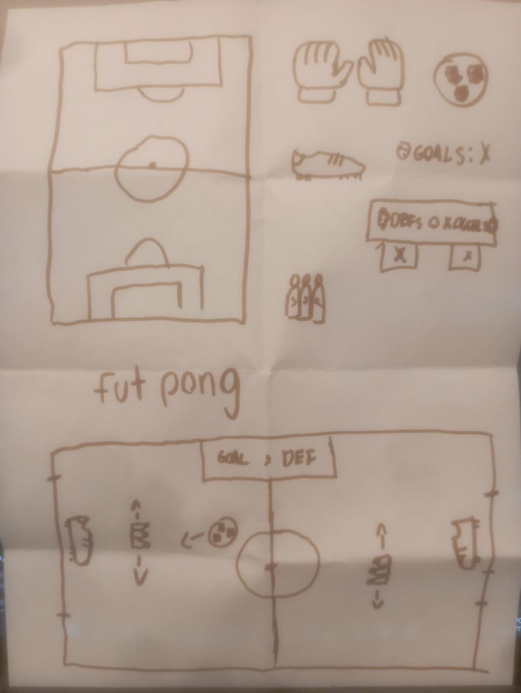
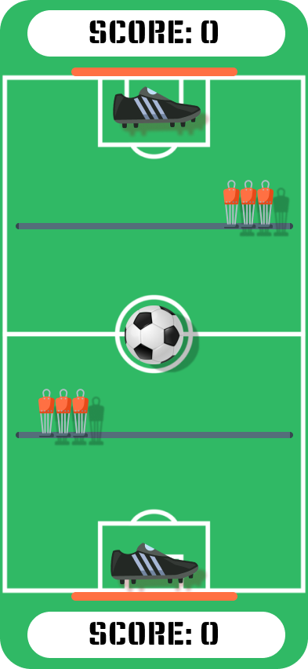

# Relatório - Reinventando Pong

## 1. Introdução  
*O objetivo da atividade “reinventando o pong” consiste em explorar a concepção de jogos a partir da análise de um jogo base. Sendo assim, por meio do estudo das mecânicas, dinâmicas e estética do clássico Pong, pode-se elaborar concept arts de um jogo semelhante, mas com inovações e elementos novos que o tornam diferente. Com base nessa lógica, escolhemos mesclar componentes do Pong com a brincadeira popular “Centroavante”, frequentemente praticada nas quadras de futsal brasileiras, a fim de construir um jogo divertido e diferenciado.*
 
---

## 2. Pesquisa e Análise Inicial  
*O clássico jogo Pong foi um dos primeiros arcades a serem desenvolvidos, seu funcionamento lembra a dinâmica do Pingue-Pongue, mas reinventada para ser praticada em um console Atari.
Ao analisar os três elementos do jogo, nota-se que sua estética é simples, mas funcional, de modo a apresentar apenas os elementos essenciais para a jogabilidade de maneira simplista, como a pontuação, paredes, uma bolinha, “barras” que atuam como uma raquete e vãos que representam algo como um gol. 
Ademais, suas mecânicas seguem a mesma lógica simplista, sendo principais a colisão da bolinha com as barras e as paredes, ou seja, a bolinha é rebatida ao tocar esses elementos e fica cada vez mais rápida, bem como o controle da barra pelos jogadores, que podem mexê-las de um lado para o outro. Outra mecânica é a de pontuação, que ocorre quando a bolinha ultrapassa o vão. Dessa forma, a dinâmica do jogo consiste no rebatimento da bolinha pelas raquetes a fim de pontuar.
Portanto, o Pong posiciona-se como um jogo envolvente devido a sua dinâmica de competição entre os jogadores, que se sentem motivados a pontuar por meio das simples, mais divertidas, mecânicas do jogo. Nesse sentido, a vontade de superar o adversário e os seus próprios limites com o aumento da velocidade da bolinha correspondem aos principais desafios que tornam a jogabilidade divertida e cativante.*

---

## 3. Proposta de Reinvenção  
*Explique as mudanças propostas para a nova versão do **Pong**, detalhando:*  

*- **Tema e Ambientação:** Qual é o novo contexto do jogo?*

*O novo contexto do pongue é o Futebol, buscamos conectar a base do jogo (O rebote de uma bola) com elementos visuais do futebol, como o background ser um campo, as antigas barras que agora são chuteiras e a substituição de uma bola lisa para uma bola de futebol.*

*- **Personagens ou Elementos Visuais:** Se houver personagens ou variações visuais, descreva.*

*O Futpongue contém uma barreira de jogadores que auxiliam no ataque rebatendo a bola de futebol de maneira mais rápida do que a chuteira, atributo esse não presente na versão original do jogo.*

*- **Mudanças na Mecânica:** Houve alguma alteração nas regras ou na forma de jogar?*

*A mecânica básica se mantém, objetos ainda são arrastados em linha horizontal para que uma bola rebata e mude de direção, entretanto adicionamos uma barreira de jogadores que pode ser controlada pelo usuário sendo arrastada para os lados. Diante disso, a mecânica é modificada, já que quando a bola toca na barreira ela é rebatida com uma maior velocidade, aumentando assim a chance de fazer um gol e aumentar o seu score.*

*- **Objetivo da Reinvenção:** O que a nova versão pretende explorar ou melhorar em relação ao original?*

*O Futpongue busca deixar o jogo mais convidativo ao usuário, uma vez que futebol é um esporte popular no Brasil e de cara, muitos desenvolverão um apego pela familiaridade com o tema. Além disso, a mudança na mecânica que permite o usuário controlar a barra (chuteira no futpongue) e também a barreira de jogadores, resulta em um desafio mais interessante, considerando que novas estratégias precisarão ser pensadas para sucesso em atacar e defender.*

**

---

## 4. Tela Digital do Jogo  
**  

*- Como o concept foi adaptado para o formato digital?*

*Nosso concept 'saiu do papel' através do figma, com o aulão de introdução da ferramenta demos os primeiros passos para entender um pouco mais acerca da sua usuabilidade. Diante disso, buscamos imagens em estilo png com transparência na web e as incomporamos no projeto. Por fim, organizamos as layers e os componentes para concretizar a tela digital do nosso concept.* 

*- Quais elementos visuais foram aprimorados?*  

*A versão original do Pongue continha elementos extremamente simples. Nesse contexto, já no nosso primeiro concept visamos mudar a barra que rebateria a bola por um objeto que dialogasse com a nova identidade visual do Futpongue - a chuteira. Além disso, desenvolvemos um background mais caractrerístico, rico em detalhes, e na atual versão digital implementamos a "Barreira de jogadores" com um caminho limitado, desenvolvido com shape tools.*

*- O uso de cores, formas e layout foi pensado para reforçar que aspectos do jogo?*  

*O campo de futebol como background já caracteriza um cenário próximo ao que se espera do jogo, além dos demais elementos como a bola de futebol e chuteiras. A cor laranja na barreira de jogadores junto a barra de gol, servem para destacar a importância desses elementos e despertar a curiosidade do usuário sobre o quanto essas partes podem agregar na jogabilidade. Por fim, a união desses elementos servem para reforçar a conexão de Futebol com base no jogo Pongue, já que o princípio se mantém, mas com uma ambientação.*

---

## 5. Reflexão e Aprendizados  
*Cada membro da dupla deve responder individualmente:*  

1. Quais foram os maiores desafios enfrentados durante o processo de criação?
2. Que habilidades foram desenvolvidas ou aprimoradas ao longo da atividade?  

---

## 6. Referências (se houver)  
*TECHTUDO. Conheça Pong, o primeiro videogame lucrativo da história, 2016. Disponível em: <https://www.techtudo.com.br/noticias/2016/03/conheca-pong-o-primeiro-videogame-lucrativo-da-historia.ghtml>. Acesso em: 12 de fev. de 2025.*

---
